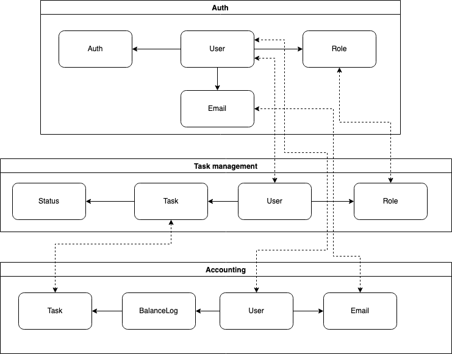
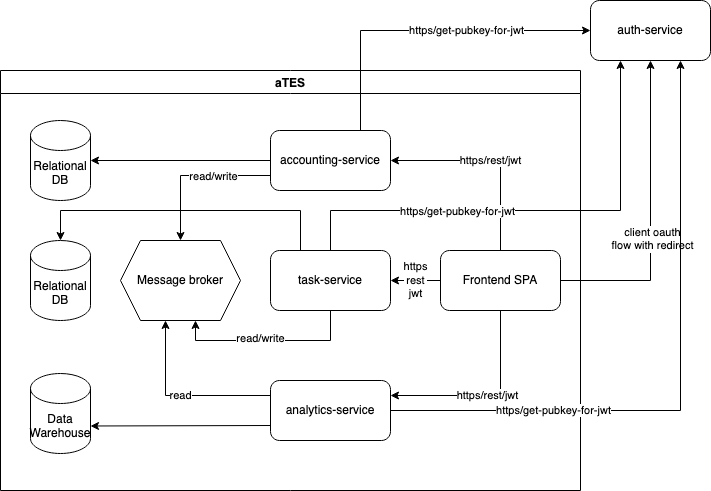
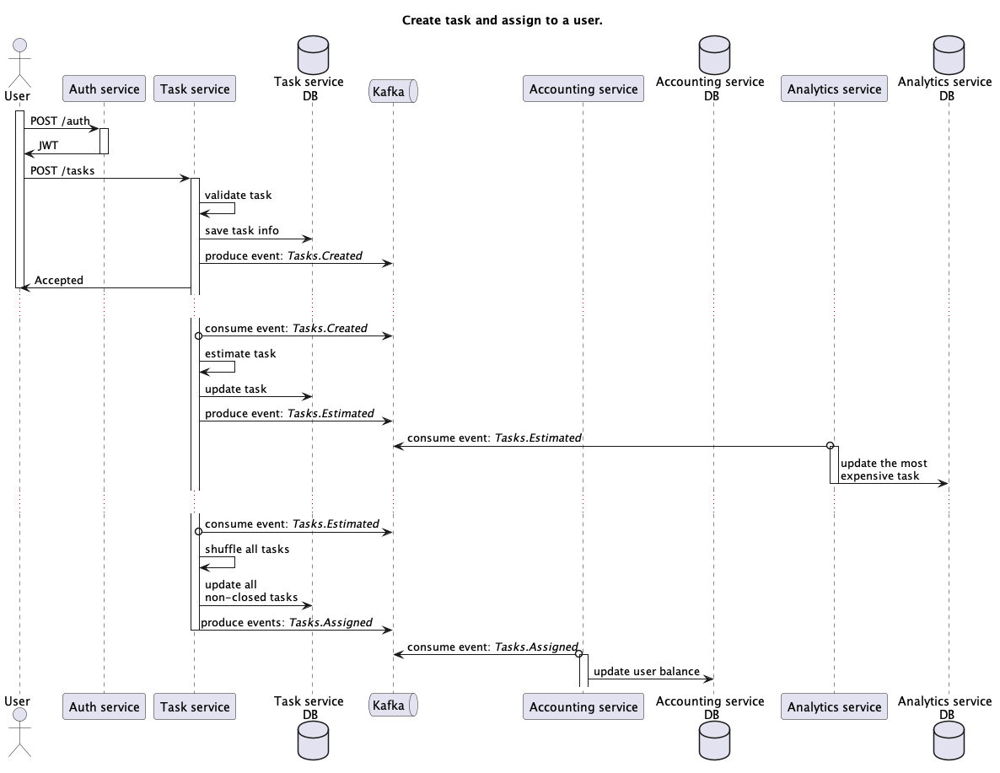
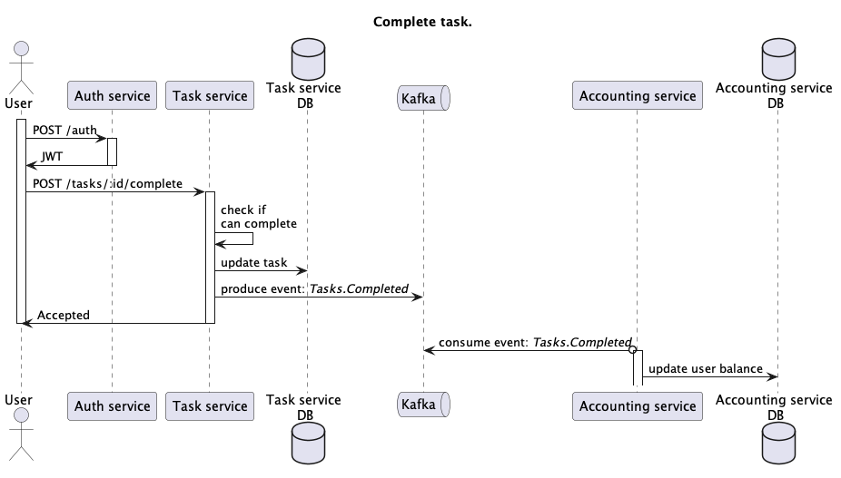

## Event storming

### Регистрация и авторизация пользователя в системе.
_Авторизация должна выполняться через общий сервис авторизации UberPopug Inc (в требованиях про регистрацию не сказано ничего, однако мы должны ответить на вопрос, как пользователи попадают в нашу систему, что бы понять на кого назначать задачи)_
- Actor - User with admin role
- Command - RegisterUser
- Data - User
- Event - Users.Registered

### Создание новой задачи.
_Новые таски может создавать кто угодно (администратор, начальник, разработчик, менеджер и любая другая роль). У задачи должны быть описание, статус (выполнена или нет) и попуг, на которого заассайнена задача._
- Actor - User with employee role
- Command - CreateTask
- Data - Task
- Event - Tasks.Created

### Оценка задачи.
_Аккаунтинг. Расценки: цены на задачу определяется единоразово, в момент появления в системе_
- Actor - Tasks.Created
- Command - EstimateTask
- Data - Task
- Event - Tasks.Estimated

### Назначение задачи.
_Менеджеры или администраторы должны иметь кнопку «заассайнить задачи»_  
_У задачи должны быть описание, статус (выполнена или нет) и попуг, на которого заассайнена задача._
- Actor - User with manager/admin role or Tasks.Estimated event
- Command - ShuffleTasks
- Data - null
- Event - Tasks.Assigned

### Выполнение задачи.
_Каждый сотрудник должен иметь возможность отметить задачу выполненной._
- Actor - User with employee role
- Command - CompleteTask
- Data - Task
- Event - Tasks.Completed

### Фин учет.
_У каждого из сотрудников должен быть свой счёт, который показывает, сколько за сегодня он получил денег. У счёта должен быть аудитлог того, за что были списаны или начислены деньги_
- Actor - Tasks.Assigned / Tasks.Completed
- Command - DecreaseBalance / IncreaseBalance
- Data - Task
- Event - null

### Выплаты в конце дня.
_В конце дня необходимо считать сколько денег сотрудник получил за рабочий день, отправлять на почту сумму выплаты. После выплаты баланса (в конце дня) он должен обнуляться, и в аудитлоге всех операций аккаунтинга должно быть отображено, что была выплачена сумма._
- Actor - EndOfTheDay (by Schedule)
- Command - Payout
- Data - PayoutInfo
- Event - null

## Domains and data model
- Auth
- Task management
- Accounting

## Services

## Business cases.
### Create task and assign to a user.

### Complete task.

### Жизненный цикл новой задачи.
CreateTask -> EstimateTask -> ShuffleTasks -> DecreaseBalance -> CompleteTask -> IncreaseBalance

### Пример обычного рабочего дня попуга.
ShuffleTasks -> DecreaseBalance -> CompleteTask -> IncreaseBalance -> EndOfTheDay -> Payout

### Набор действий, для администратора при онбординге нового попуга.
RegisterUser -> ShuffleTasks

### Пример рабочего дня менеджера.
ShuffleTasks -> ShuffleTasks -> ShuffleTasks -> ShuffleTasks -> ...